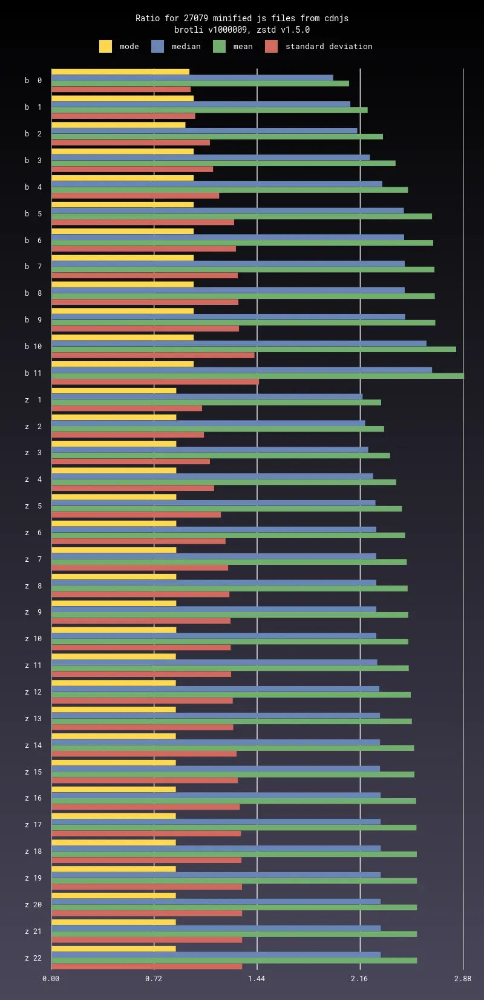

# Comparison of brotli and zstd

There are similar bindings for ruby:
[ruby-brs](https://github.com/andrew-aladev/ruby-brs) and
[ruby-zstds](https://github.com/andrew-aladev/ruby-zstds), it supports streaming API.
It is possible to make easy benchmark between
[brotli](https://github.com/google/brotli) and
[zstd](https://github.com/facebook/zstd).

## Installation

You need to install recent version of
[sparsehash](https://github.com/sparsehash/sparsehash),
[brotli](https://github.com/google/brotli),
[zstd](https://github.com/facebook/zstd),
[image magick](https://github.com/ImageMagick/ImageMagick) and
[ruby](https://github.com/ruby/ruby).

```sh
gem install bundler
bundle install
```

## Samples

Please download recent versions of
[google fonts](https://github.com/google/fonts),
[static HTML dump of wikipedia](https://dumps.wikimedia.org/other/static_html_dumps/current/eu/) and
[cdnjs](https://github.com/cdnjs/cdnjs).

```sh
git clone git@github.com:google/fonts.git --depth=1

mkdir wikipedia
wget "https://dumps.wikimedia.org/other/static_html_dumps/current/eu/wikipedia-eu-html.tar.7z"
7z x -so wikipedia-eu-html.tar.7z | tar xf - -C wikipedia
rm wikipedia-eu-html.tar.7z

git clone git@github.com:cdnjs/cdnjs.git --depth=1
./scripts/cleanup_cdnjs.sh cdnjs
```

## Benchmark

Please run prepared process scripts.

```sh
./scripts/data/google_fonts.sh /mnt/data/fonts
./scripts/data/wikipedia.sh /mnt/data/wikipedia
./scripts/data/cdnjs.sh /mnt/data/cdnjs
```

Accurate performance measurement requires running in single thread, so processing takes a lot of time.

It will populate results and update [data folder](data).
You can add your own custom script, please look at scripts inside [scripts/data](scripts/data) folder.

## Chart

Please run prepared process scripts.

```sh
./scripts/chart/google_fonts.sh
./scripts/chart/wikipedia.sh
./scripts/chart/cdnjs.sh
```

It will populate charts and update [chart folder](chart).
You can add your own custom script, please look at scripts inside [scripts/chart](scripts/chart) folder.

Chart folder path consist of `name/extension/type/chart_type`, files inside may be `from_size - to_size.webp` or `all.webp`.
For example chart folder path `cdnjs/js/min/ratio`, file inside `64 KiB - 128 KiB.webp`.

`type` may be `any/min/not_min`.
Please read more about `chart_type` in [lib/chart/process.rb](lib/chart/process.rb).

Example:



## License

MIT license, see [LICENSE](LICENSE), [AUTHORS](AUTHORS) and [NOTICE](NOTICE).
