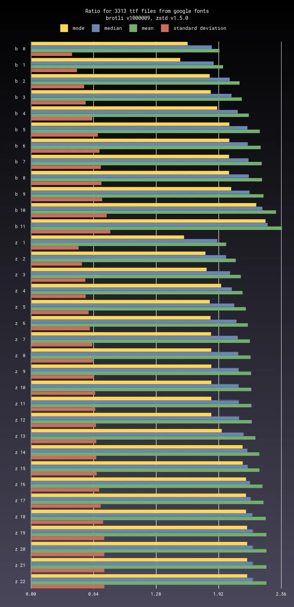

# Comparison of brotli and zstd

## Installation

You need to install recent version of
[brotli](https://github.com/google/brotli), [zstd](https://github.com/facebook/zstd),
[image magick](https://github.com/ImageMagick/ImageMagick) and [ruby](https://github.com/ruby/ruby).

```sh
gem install bundler
bundle install
```

## Samples

Please download recent versions of [google fonts](https://github.com/google/fonts),
[cdnjs](https://github.com/cdnjs/cdnjs) and
[static HTML dump of wikipedia](https://dumps.wikimedia.org/other/static_html_dumps/current/en/).
You can use any large HDD `1 TB +`, for example `/mnt/data`.

```sh
cd /mnt/data
git clone git@github.com:google/fonts.git --depth=1
git clone git@github.com:cdnjs/cdnjs.git --depth=1
mkdir wikipedia
wget "https://dumps.wikimedia.org/other/static_html_dumps/current/en/wikipedia-en-html.tar.7z"
7z x -so wikipedia-en-html.tar.7z | tar xf - -C wikipedia
rm wikipedia-en-html.tar.7z
```

## RAM usage

We are creating compressors and decompressors for each param combination.
All compressors and decompressors are sitting inside RAM together.
Each file passes through all processors.
Benchmark requires about `8 GB` of free RAM.

## Benchmark

Please run prepared process scripts.

```sh
./scripts/data/process_google_fonts.sh /mnt/data/fonts
./scripts/data/process_cdnjs.sh /mnt/data/cdnjs
./scripts/data/process_wikipedia.sh /mnt/data/wikipedia
```

This benchmark will take about `4 weeks` on modern machine.
It will populate results and update [data folder](data).

You can add your own custom script, please look at [scripts/data folder](scripts/data).

## Chart

Please run prepared process scripts.

```sh
./scripts/chart/process_google_fonts.sh
./scripts/chart/process_cdnjs.sh
./scripts/chart/process_wikipedia.sh
```

Scripts will populate charts and update [chart folder](chart).

Example:



## License

MIT license, see [LICENSE](LICENSE), [AUTHORS](AUTHORS) and [NOTICE](NOTICE).
